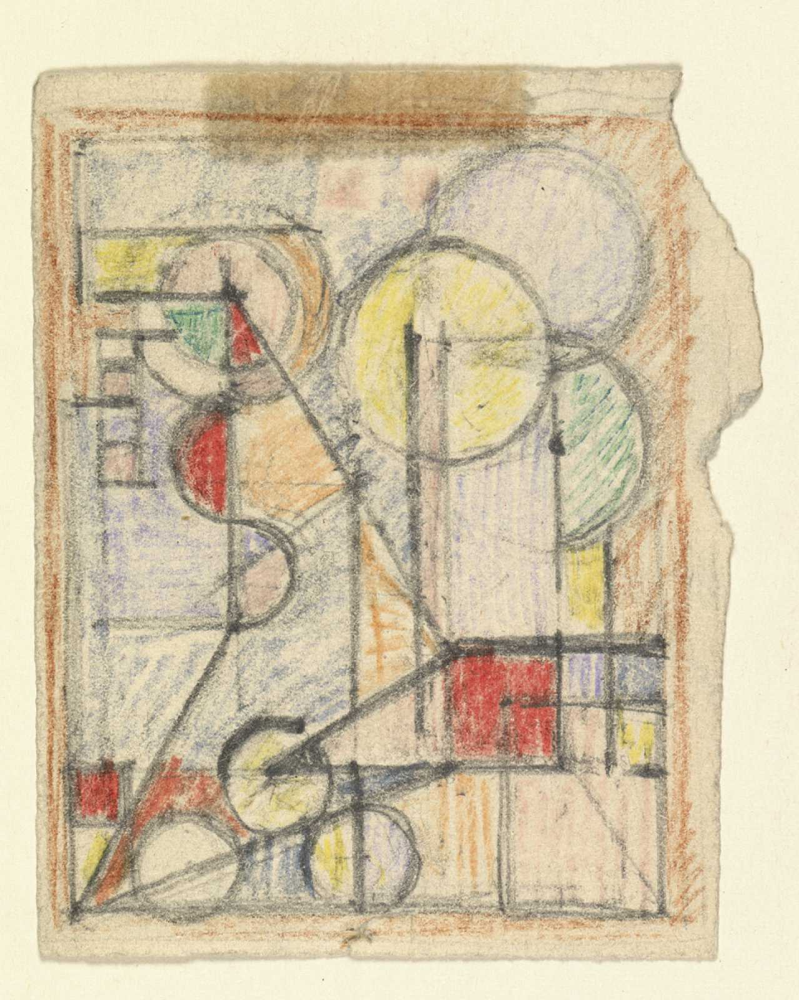

# BePAPER

The BePAPER-project will provide a first overview of the field of Belgian avant-garde works on paper within an international context between 1918 and 1950, that is, up and until the dawn of CoBrA and the rise of the so-called neo-avant-gardes. The project will contribute to a better definition of the collection category of “modern works on paper”.

The BePAPER project is a BRAIN project, supported by BELSPO.

[Contact us](mailto:bepaper@fine-arts-museum.be)

